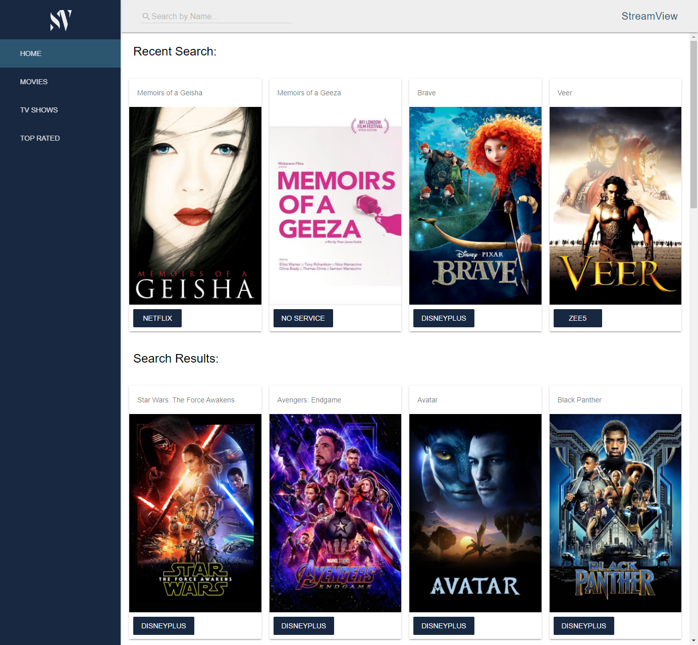

# StreamView aka (!IMDB)
This is a Show / Movie subscription dashboard.

## Description

This is a web application where an end user is able to search for a movie or tv show and see which streaming service that media is available to view on.  As a user you are also able to view the top rated movies, tv shows, or both to find out which streaming service that media is available to watch.

## Utility

### Installation
You can view the website here: https://emdok.github.io/bang-imdb/

### Usage

### CSS / HTML Framework

#### Tools
 - Material Design Lite CSS
 - FontAwesome Icons
 

#### Home Page
 - Header CSS
    - Search bar
 - Sidebar/drawer (Open on full screen / closed on mobile)
    - Logo
    - Quick searches (HOME/MOVIES/TV SHOWS/TOP RATED)
 - Cards (Recent Search | Search Results)
 - Buttons:
    - Streaming Service - User is taken to the streaming service to watch tv show or movie
